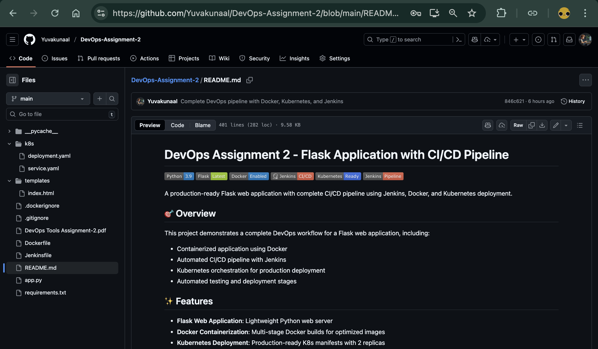
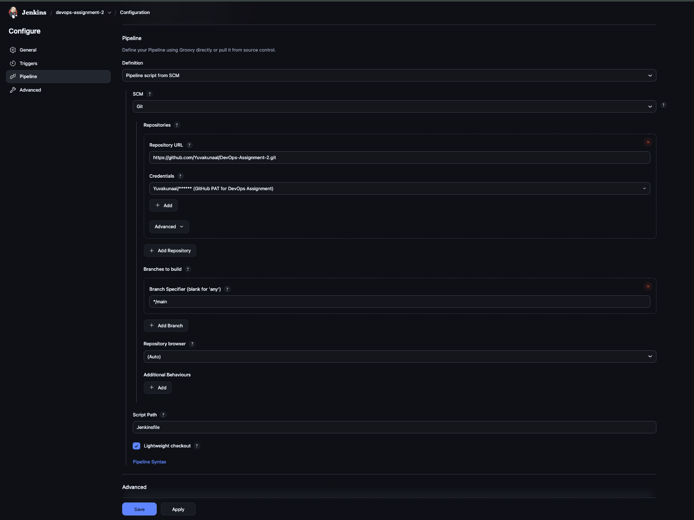
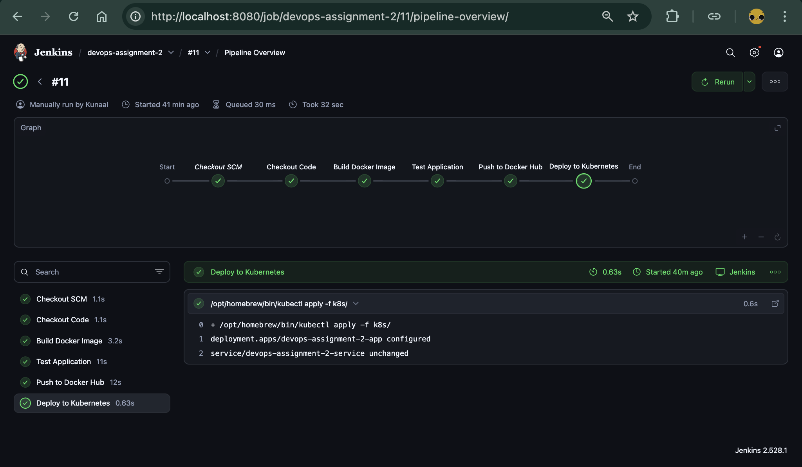
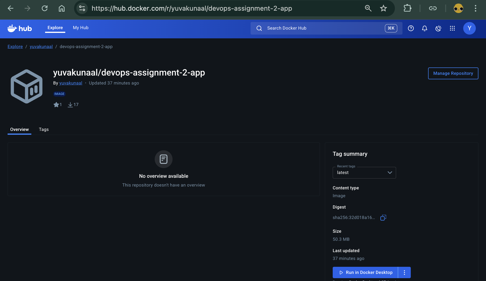
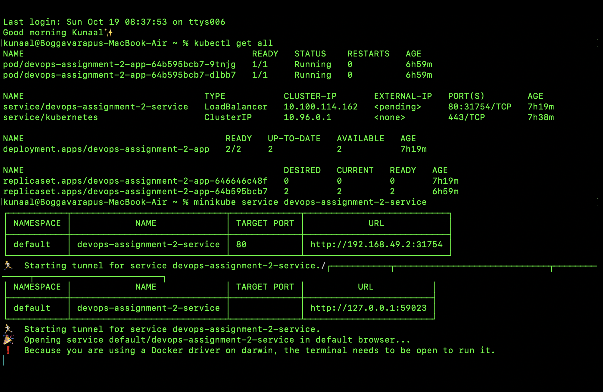
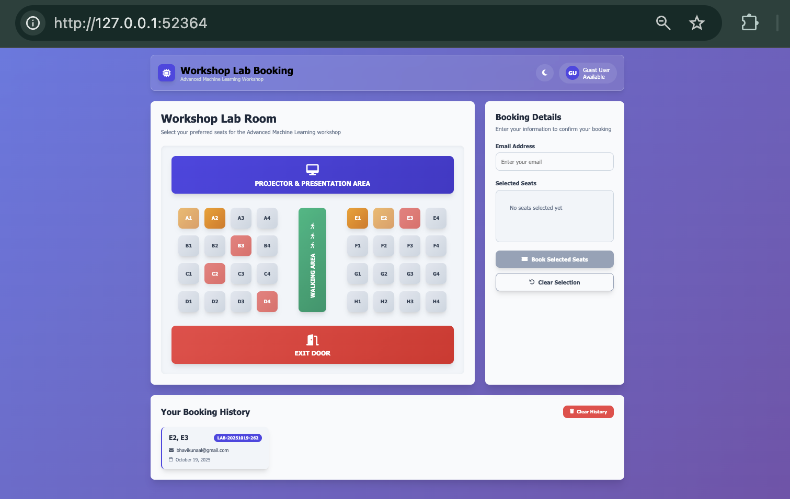

# DevOps Assignment 2 - Flask Application with CI/CD Pipeline


A production-ready Flask web application with complete CI/CD pipeline using Jenkins, Docker, and Kubernetes deployment.

## 🎯 Overview

This project demonstrates a complete DevOps workflow for a Flask web application, including:

- Containerized application using Docker
- Automated CI/CD pipeline with Jenkins
- Kubernetes orchestration for production deployment
- Automated testing and deployment stages

## 🌐 About Web Application

This website is a modern Workshop Lab Booking System for an Advanced Machine Learning workshop. Users can view a visual layout of the lab, select and book available seats, and manage their bookings through an intuitive interface. The platform supports booking history, seat selection limits, and VIP seat options. It features responsive design, dark mode, and instant feedback for a seamless user experience. All bookings are confirmed with a unique ticket and can be reviewed or cleared by the user.

## ✨ Features

- **Flask Web Application**: Lightweight Python web server
- **Docker Containerization**: Multi-stage Docker builds for optimized images
- **Kubernetes Deployment**: Production-ready K8s manifests with 2 replicas
- **Jenkins Pipeline**: Automated build, test, and deployment
- **Docker Hub Integration**: Automated image push to Docker Hub registry
- **Health Checks**: Automated application testing in CI/CD pipeline
- **Resource Management**: Kubernetes resource limits and requests configured
- **Load Balancing**: Kubernetes LoadBalancer service for external access

## 🏗️ Architecture

```
┌─────────────┐     ┌──────────────┐     ┌─────────────┐
│   GitHub    │────▶│   Jenkins    │────▶│ Docker Hub  │
│ Repository  │     │   Pipeline   │     │  Registry   │
└─────────────┘     └──────────────┘     └─────────────┘
                           │                      │
                           │                      │
                           ▼                      ▼
                    ┌──────────────┐     ┌─────────────┐
                    │ Kubernetes   │◀────│   Docker    │
                    │   Cluster    │     │    Image    │
                    └──────────────┘     └─────────────┘
                           │
                           ▼
                    ┌──────────────┐
                    │ LoadBalancer │
                    │   Service    │
                    └──────────────┘
```

## 📦 Prerequisites

Before you begin, ensure you have the following installed:

- **Python 3.9+**: [Download Python](https://www.python.org/downloads/)
- **Docker**: [Install Docker](https://docs.docker.com/get-docker/)
- **Kubernetes (kubectl)**: [Install kubectl](https://kubernetes.io/docs/tasks/tools/)
- **Minikube** (for local K8s): [Install Minikube](https://minikube.sigs.k8s.io/docs/start/)
- **Jenkins** (for CI/CD): [Install Jenkins](https://www.jenkins.io/doc/book/installing/)
- **Git**: [Install Git](https://git-scm.com/downloads)

## 📁 Project Structure

```
DevOps-Assignment-2/
│
├── app.py                      # Main Flask application
├── requirements.txt            # Python dependencies
├── Dockerfile                  # Docker image configuration
├── Jenkinsfile                 # Jenkins pipeline definition
├── README.md                   # Project documentation
│
├── templates/                  # Flask HTML templates
│   └── index.html             # Homepage template
│
├── k8s/                        # Kubernetes manifests
│   ├── deployment.yaml        # K8s deployment configuration
│   └── service.yaml           # K8s service configuration
│
└── __pycache__/               # Python cache (auto-generated)
```

## 💻 To use this in your systems

_Pull the image first_

1. If your system is Mac

```bash
docker pull yuvakunaal/devops-assignment-2-app
```

2. If your system is Windows

```bash
docker pull --platform linux/arm64 yuvakunaal/devops-assignment-2-app
```

_Run the image_

```bash
docker run -p 8001:8000 yuvakunaal/devops-assignment-2-app
```

_(Optional) If you want to run in the background even after closing the terminal :-_

```bash
docker run -d -p 8001:8000 yuvakunaal/devops-assignment-2-app
```

_Now open Chrome/browser and type this in search_
```bash
http://0.0.0.0:8001/
```

## 🚀 Local Development

### 1. Clone the Repository

```bash
git clone https://github.com/Yuvakunaal/DevOps-Assignment-2.git
cd DevOps-Assignment-2
```

### 2. Install Dependencies

```bash
pip install -r requirements.txt
```

### 3. Run the Application

```bash
# Development server (Flask)
python app.py

# Production server (Gunicorn)
gunicorn --bind 0.0.0.0:8000 app:app
```

### 4. Access the Application

Open your browser and navigate to:

```
http://localhost:8000
```

## 🐳 Docker Deployment

### Build Docker Image

```bash
docker build -t devops-assignment-2-app .
```

### Run Docker Container

```bash
docker run -d -p 8000:8000 --name devops-app devops-assignment-2-app
```

### Stop and Remove Container

```bash
docker stop devops-app
docker rm devops-app
```

### Push to Docker Hub

```bash
# Tag the image
docker tag devops-assignment-2-app yuvakunaal/devops-assignment-2-app:latest

# Login to Docker Hub
docker login

# Push the image
docker push yuvakunaal/devops-assignment-2-app:latest
```

## ☸️ Kubernetes Deployment

### Start Minikube (Local Development)

```bash
minikube start
```

### Deploy to Kubernetes

```bash
# Apply all manifests
kubectl apply -f k8s/

# Or apply individually
kubectl apply -f k8s/deployment.yaml
kubectl apply -f k8s/service.yaml
```

### Check Deployment Status

```bash
# Check pods
kubectl get pods

# Check deployments
kubectl get deployments

# Check services
kubectl get services

# Get detailed pod information
kubectl describe pod <pod-name>
```

### Access the Application

```bash
# For Minikube
minikube service devops-assignment-2-service

# Or get the service URL
minikube service devops-assignment-2-service --url
```

### Scale the Application

```bash
# Scale to 3 replicas
kubectl scale deployment devops-assignment-2-app --replicas=3

# Verify scaling
kubectl get pods
```

### Delete Deployment

```bash
kubectl delete -f k8s/
```

## 🔄 CI/CD Pipeline

The Jenkins pipeline automates the entire deployment process with the following stages:

### Pipeline Stages

1. **Checkout Code**: Clones the latest code from GitHub
2. **Build Docker Image**: Builds the Docker image from Dockerfile
3. **Test Application**: Runs automated tests on the container
4. **Push to Docker Hub**: Pushes the image to Docker Hub registry
5. **Deploy to Kubernetes**: Applies Kubernetes manifests

### Jenkins Setup

1. **Install Jenkins** and required plugins:

   - Docker Pipeline
   - Kubernetes CLI
   - Git

2. **Configure Docker Hub Credentials**:

   - Go to Jenkins → Manage Jenkins → Manage Credentials
   - Add credentials with ID: `docker-hub-cred`
   - Use your Docker Hub username and password/token

3. **Create Pipeline Job**:

   - New Item → Pipeline
   - Configure SCM to point to your GitHub repository
   - Select `Jenkinsfile` as the pipeline script path

4. **Run the Pipeline**:
   - Click "Build Now"
   - Monitor the pipeline execution in Jenkins

### Pipeline Environment Variables

```groovy
DOCKERHUB_CREDENTIALS = credentials('docker-hub-cred')
```

## ⚙️ Configuration

### Application Configuration

The Flask application runs on port `8000` by default. You can modify this in:

- `Dockerfile`: `EXPOSE` directive
- `k8s/deployment.yaml`: `containerPort`
- `k8s/service.yaml`: `targetPort`

### Kubernetes Resources

Current resource allocation per pod:

```yaml
resources:
  requests:
    memory: "128Mi"
    cpu: "100m"
  limits:
    memory: "256Mi"
    cpu: "200m"
```

Modify these values in `k8s/deployment.yaml` based on your requirements.

### Replica Count

Default replicas: **2**

To change, update `k8s/deployment.yaml`:

```yaml
spec:
  replicas: 3 # Change to desired number
```

## 📸 Screenshots

### Github Repository


_Pushed Complete Project to Github Repository_

### Jenkins Pipeline Configure


_Full Configuration of Jenkins Pipeline before Running the `build Now`_

### Jenkins Pipeline Success


_Complete CI/CD pipeline with all stages successful_

### Docker Hub Repository


_Docker image successfully pushed to Docker Hub registry_

### Kubernetes Deployment


_Application running in Kubernetes cluster with multiple replicas_

### Application Interface


_Workshop Lab Booking System running in browser_

## 🧪 Testing

### Manual Testing

```bash
# Test the running application
curl http://localhost:8000

# Health check
curl -f http://localhost:8000 || echo "Application is down"
```

### Automated Testing (Jenkins)

The Jenkins pipeline includes automated testing:

```bash
curl -f http://localhost:8001 || exit 1
```

## 🔧 Troubleshooting

### Docker Issues

**Problem**: Container fails to start

```bash
# Check container logs
docker logs devops-app

# Inspect container
docker inspect devops-app
```

**Problem**: Port already in use

```bash
# Find process using the port
lsof -i :8000

# Kill the process or use a different port
```

### Kubernetes Issues

**Problem**: Pods not starting

```bash
# Check pod status
kubectl get pods

# View pod logs
kubectl logs <pod-name>

# Describe pod for events
kubectl describe pod <pod-name>
```

**Problem**: Service not accessible

```bash
# Check service endpoints
kubectl get endpoints

# Verify service configuration
kubectl describe service devops-assignment-2-service
```

**Problem**: ImagePullBackOff error

```bash
# Ensure Docker Hub image is public or
# Create imagePullSecret for private images
kubectl create secret docker-registry regcred \
  --docker-server=https://index.docker.io/v1/ \
  --docker-username=<username> \
  --docker-password=<password> \
  --docker-email=<email>
```

### Jenkins Issues

**Problem**: Docker command not found

- Ensure Docker is installed on Jenkins agent
- Update Jenkinsfile with correct Docker path

**Problem**: kubectl command not found

- Install kubectl on Jenkins agent
- Update Jenkinsfile with correct kubectl path

## 👤 Author

**Yuvakunaal**

- GitHub: [https://github.com/Yuvakunaal](https://github.com/Yuvakunaal)
- Docker Hub: [https://hub.docker.com/u/yuvakunaal](https://hub.docker.com/u/yuvakunaal)

## 🙏 Acknowledgments

- Flask framework for the web application
- Docker for containerization
- Kubernetes for orchestration
- Jenkins for CI/CD automation

> **⭐ If you find this project helpful, please give it a star!**
